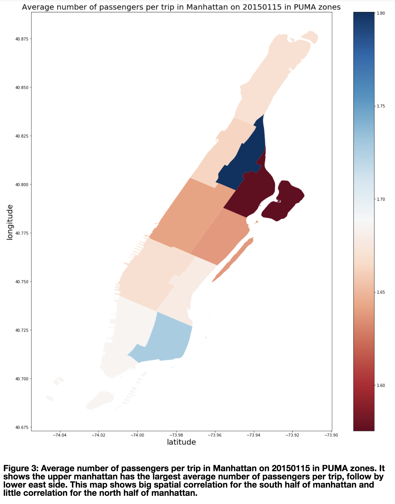

This homework assignment 1, I worked on improving my visualizations from last week. 

For Figure 1,2 and 4, I added x and y axis labels and titles for all of them. For figure 3, I filter the puma dataframe to only Manhattan and allow the visualization be more clear by only showing the data for Manhattan. 
Here are the new plots: 

