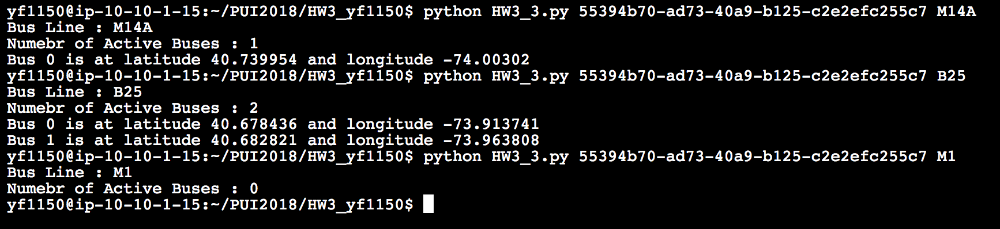

This week I finished 3 Assignments individually. 

The first assignment I learn how to completely remove the history of a file on github. 
Here is the screenshot of the evidence showing that the test.csv file existed in my Lab3_yf1150 folder: 

This is showing the history has been removed:

The second assignment, I import and plot a dataset I found on NYU Open Data. The dataset is about City-owned sites that are available and potentially suitable for urban agriculture. Please see the Jupyter Notebook file "HW3_2.ipynb".

The third assignment, please see the Python file "HW3_3.py". I tested it with terminal and it gave me the correct output. 

The fourth assignment, please see the Python file "HW3_4.py". 