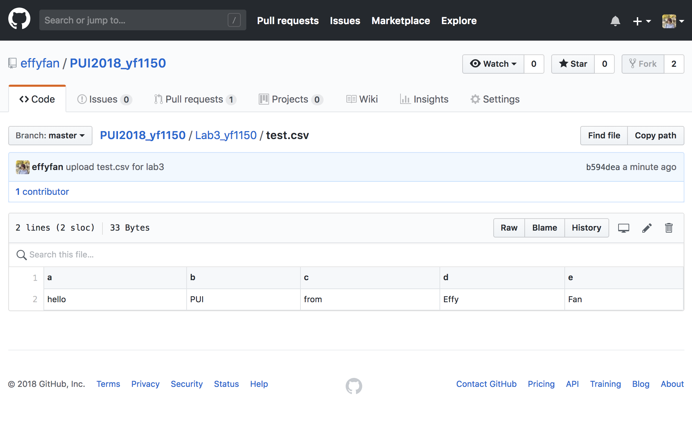
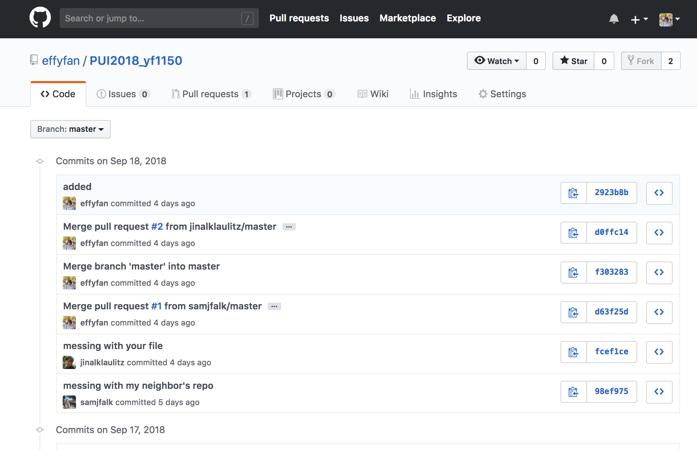

This week I finished 3 Assignments.

The first one is to learn how to completely remove the history of a file on github. 
Here is the screenshot of the evidence showing that the test.csv file existed in my Lab3_yf1150 folder: 

This is showing the history has been removed:
