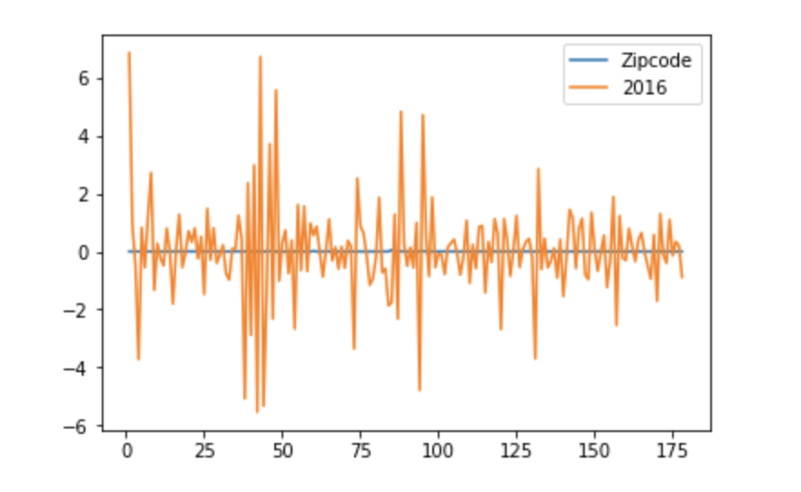
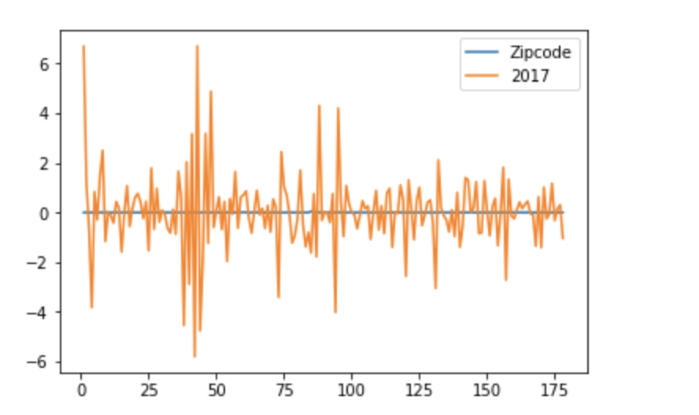
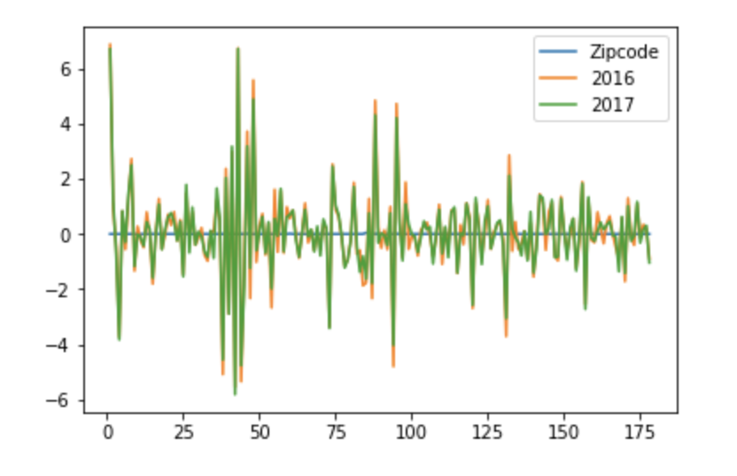

### Comments: The topic of 311 noisy data is interesting. The first 3 plots are missing titles. It would be better to add captions on the x and y axis to all the plots as well. The zipcode line on the plot is a little confusing because it doesn't show the normal 5 digits zipcode in NYC. I notice the dataset you use contains the latitude and longitude of each complaint. I would suggestion to visualize the noisy complaints data on a map of NYC so that it contains more geo-spacial information. It would be nice to see which area has more complaints and compare between 2016 and 2017.  